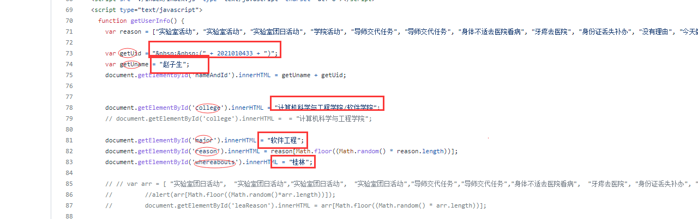
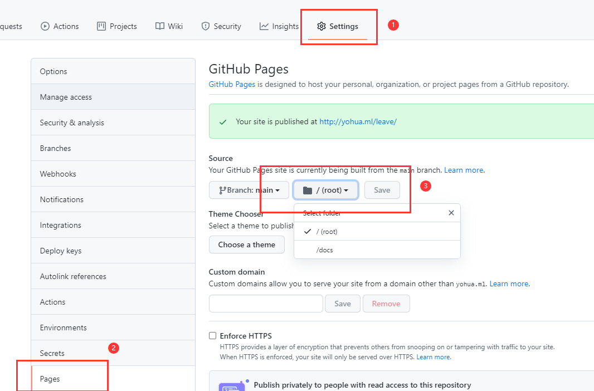

# **Leave of gxnu-yzdx**

> * 使用者有责任和义务保证自己的行为安全并能对自己负责。
> * 本项目仅供学习交流使用，严禁用于其他用途！ For learning and communication only, other use is strictly prohibited！
> * 作者不承担任何法律责任！The author assumes no legal liability！

Leave under some special circumstances.

demo: https://dx78c.github.io/leave/

**准备一个GitHub账号**
## 使用方法

### 1. fork此项目
项目地址：https://github.com/colflip/leave

### 2. 修改个人信息
打开index.html，修改信息:

### 3. 开启GitHub Page  
Settings->Pages:

**访问(username是自己的GitHub用户名)：https://username.github.io/leave**

## licence
[MIT](LICENSE)

## feedback
[Leave me a message](https://github.com/colflip/leave/issues/new)

